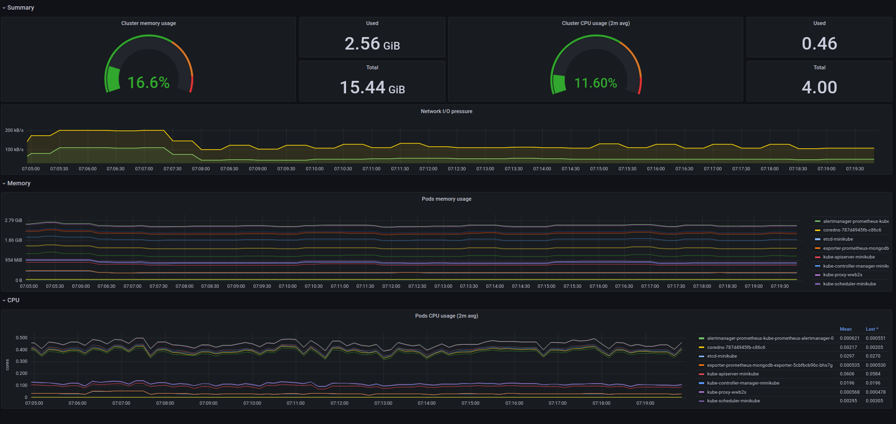

# Exercice 1 - Configurer sa source de données et son premier Dashboard

## Pré-requis

- Avoir accès à l'interface graphique de Grafana
- Avoir une base de données de métriques

## Présentation 

- Un cluster kubernetes est déployé. Il contient : 
    - des pods prometheus
    - des pods mysql et son exporter
    - un mongodb et son exporter
- Des métriques sont récupérées de ces pods et du cluster et stocker dans une base Prométheus
- Nous allons au fur et à mesure des exercices construire les tableaux de bord suivants :
    - tableau de bord qui monitore l'état du cluster et des différents objets du cluster
    - tableau de bord qui surveille les BDD SQL (MariaDB)

## Configurer notre source de données et explorer celle-ci : 

### Ajouter une source de données à Grafana

- Dans Grafana, ouvrir le menu, puis dans l'item `Configuration`, cliquer sur Data sources
- Vous arrivez alors sur la liste des sources de données
- Pour ajouter une source de données, cliquer sur `Add data source`
- Dans la catégorie `Time serie base`, Choisir `Prometheus` 
- Vous arrivez alors sur une page de paramètrage
- Le seul paramètre obligatoire est alors l'adresse de Prometheus, à renseigner avec l'adresse qui vous a été fournie pendant la formation
- Les autres paramètres permettent par exemple de configurer une authentification, dans le cas où l'accès à Prometheus est protégé (ce n'est pas le cas dans le cadre de la formation)
- Cliquer en bas de la page sur `Save and test`
- Vous devriez obtenir un message `Data source is working`, dans le cas contraire, vérifier l'adresse saisie et les paramètres que vous avez modifié (il n'est pas nécessaire dans le cadre de la formation de modifier les paramètres)
- Vos données sont maintenant accessibles depuis Grafana

### Explorer les données

- Dans le menu de Grafana, cliquer sur Explore
- Tout en haut à côté du titre `Explore` vous pouvez sélectionner votre source de données
- Puis en sélectionnant votre source Prométheus, vous pouvez faire des requêtes pour afficher les données disponibles.
- Pour connaître la liste des données vous pouvez cliquer sur la flèche en dessous de Metrics, cela vous permet de voir les métriques qui sont disponibles dans votre source de données.
- L'ensemble des métriques disponibles est décrite ici : https://github.com/google/cadvisor/blob/master/docs/storage/prometheus.md 

### Métriques utilisées :

- Nous allons utiliser différentes métriques pour construire nos tableaux de bords.
- Celle-ci sont réparties dans les target prometheus suivantes :
    - mysql-exporter
    - mongodb-exporter
    - node-exporter
    - ku??

## Création du premier dashboard de surveillance du cluster

### Définition des métriques et des types de graphiques

- Nous souhaitons monitorer notre cluster sur les éléments suivants :
    - Utilisation du CPU
    - Utilisation de la RAM
    - Trafic réseau entrant / sortant
    - CPU et RAM par pods 
- Pour chacune de ces métriques nous allons définir des visualisations comme suit : 
    - CPU : Gauge et Stats
    - RAM : Gauge et Stats
    - Trafic Réseaux : TimeSerie 
    - Utilisation mémoire par Pod : Time Serie
    - Utilisation CPU par Pod : Time Serie

### Organisation du tableau de bord

- En haut du tableau de bord nous souhaitons avoir une ligne pour le cluster avec les valeurs courantes du CPU et de la RAM du cluster, et un graphique d'utilisation du réseau
- Puis une lignes avec l'utilisation de la mémoire par Pod
- Enfin une ligne avec l'utilisation du CPU par Pod
- Créer un tableau de bord avec les différentes lignes, et les différents panels (si besoin d'un rappel sur les créations de graphiques voir [cet exercice](../exercice-2-premier-dashboard.md))

- Le résultat ressemblera à celui-ci :

### (Si besoin) Requêtes préparées pour les graphiques :

- Utilisation du CPU : `sum (rate (container_cpu_usage_seconds_total{kubernetes_io_hostname=~"^$Node$"}[$interval])) / sum (machine_cpu_cores{kubernetes_io_hostname=~"^$Node$"}) * 100`
- Utilisation de la RAM : `sum (container_memory_working_set_bytes{kubernetes_io_hostname=~"^$Node$"}) / sum (machine_memory_bytes{kubernetes_io_hostname=~"^$Node$"}) * 100`
- Trafic réseau entrant : `instance:node_network_receive_bytes:rate:sum{}` 
- Trafic réseau sortant : `instance:node_network_transmit_bytes:rate:sum{}`
- RAM par pod : `sum by(pod) (container_memory_working_set_bytes{kubernetes_io_hostname=~"^$Node$"})`
- CPU par pod : `sum (rate (container_cpu_usage_seconds_total{kubernetes_io_hostname=~"^$Node$"}[$interval])) by (pod)`

## Pour aller plus loin - Définir ses indicateurs et les requêtes associées

- Quels sont selon vous les indicateurs qu'il manquerait sur le monitoring de notre cluster ?
- A l'aide de la [documentation de PromQL](https://prometheus.io/docs/prometheus/latest/querying/basics/) (le langage de requête de Prometheus) et des métriques disponibles dans prométheus définir les requêtes qui vous permettent d'obtenir les métriques à surveiller pour ajouter ces élements manquants.
- Pour chaque nouvelle métrique, définir le type de graphique associé et les ajouter au tableau de bord
