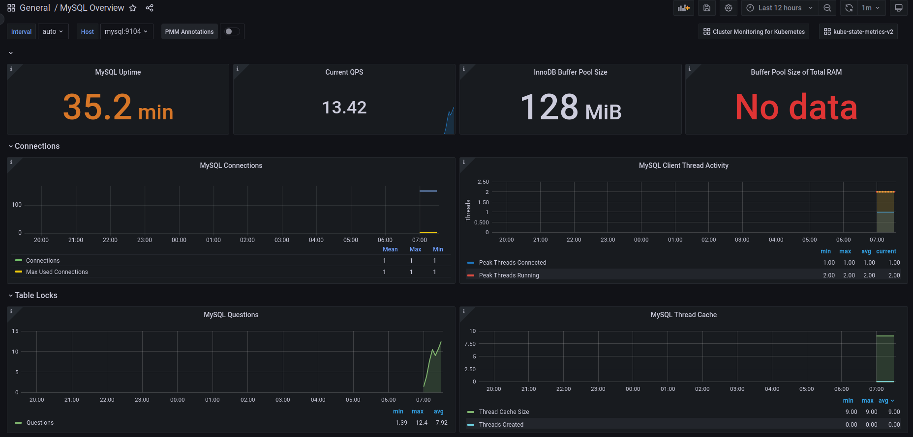

# Création et paramètrage d'un tableau de bord pour surveiller des BDD SQL

## Pré-requis

- Avoir accès à l'interface graphique de Grafana
- Avoir une base de données de métriques

## Présenation du tableau de bord

* Nous allons réaliser un tableau de bord qui permet de monitorer des instances de MariaDB ou MySQL. 
* Pour cela nous avons besoin de métriques d'utilisation des bases et de définir ce que nous souhaitons monitorer. Ici nous allons monitorer : 
    * Depuis combien de temps notre instance est en route
    * Le nombre de statement exécutés
    * La taille du tampon InnoDB
    * L'utilisation de la RAM par le tampon
    * Les connections
    * Les verrous 
* D'autres métriques peuvent être pertinentes, n'hésitez pas à utiliser les tableaux de bords pré-existant sur le site de Grafana pour construire vos propres tableaux de bords.

## Stats 

* La première ligne contient les stats suivantes :
    * Uptime : `mysql_global_status_uptime{}`
    * Current QPS : `rate(mysql_global_status_queries{}[$interval]) or irate(mysql_global_status_queries{}[5m])`
    * InnodDB Buffer Pool Size : `mysql_global_variables_innodb_buffer_pool_size{}`
    * Buffer Pool Size of Total RAM : `(mysql_global_variables_innodb_buffer_pool_size{} * 100) / on (instance) node_memory_MemTotal_bytes{}`
* Créer les 4 panels de stats avec les requêtes
* Pour chaque panel définir les éléments suivants : 
    * Thresolds 
    * Configuration de l'unité
    * Si oui ou non on veut afficher la courbe d'évolution (uniquement poru Current QPS)
    * Une description et un titre de Panel 

## Connections et table lock :

* Les deux lignes suivantes contiennent des visualisations de type time serie
    * MysQL connections 
        * `max(max_over_time(mysql_global_status_threads_connected{}[$interval])  or mysql_global_status_threads_connected{} )`
        * `mysql_global_status_max_used_connections{}`
        * `mysql_global_variables_max_connections{}`
    * MySQL Client thread Activity :
        * `max_over_time(mysql_global_status_threads_connected{}) or max_over_time(mysql_global_status_threads_connected{}[5m])`
        * `max_over_time(mysql_global_status_threads_running{}[$interval]) or max_over_time(mysql_global_status_threads_running{}[5m])`
        * `avg_over_time(mysql_global_status_threads_running{}[$interval]) or avg_over_time(mysql_global_status_threads_running{}[5m])`
    * MySQL Questions : `rate(mysql_global_status_questions{}[$interval]) or irate(mysql_global_status_questions{}[5m])`
    * MySQL Thread Cache : 
        * `mysql_global_variables_thread_cache_size{}`
        * `mysql_global_status_threads_cached{instance="$host"}`
* Pour chacun des panels ajouter les requêtes fournies, puis configurer les options suivantes :
    * titre et description du panel
    * Legend (on veut un tableau avec les valeurs présentées)
    * Options standard : unité, minimum
    * Ajouter un override de champ pour définir une opacitié à 0, ce qui permet de supprimer l'opacité du remplissage 

## Pour aller plus loin

* Quels seraient les autres métriques pertinentes à surveiller sur des applications de type BDD SQL ?
* Quels seraient les visualisations nécessaires pour ces graphique
* N'hésitez pas à faire un tour dans les dashboard sur grafana.com pour avoir des idées et essayer de mettre en place ces visualisations.