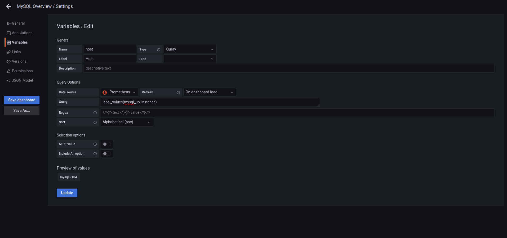

# Exercice 3 - Rendre dynamique son tableau de bord

## Définition d'une variable

* Ajouter à votre tableau de bord une variable permettant de filtrer les données pour un namespace
* Pour cela déclarer votre variable dans les paramètres du Dashboard, menu Variables.
* Cliquer sur New 
* Choisir un nom de variable, puis le type de variable (ici nous choisissons Query pour récupérer une liste dynamique d'instances). Dans la requête nous utilisons la requêtes suivantes pour lister les conteneurs : 
```
label_values(namespace)
```
* Ensuite vous définissez le filtre à appliquer 



* La variable apparaît alors en haut du tableau de bord.

## Utiliser la variable dans ses requêtes

* Puis utiliser cette variable dans vos requêtes pour chacun de vos panels afin de filtrer les données, on ajoute entre accolade le nom du paramètre de filtre suivi de = et le nom de la variable précédé par le symbole dollar.

Exemple : 
La requête : 
```
sum by(pod) (container_memory_working_set_bytes{})```
```
Deviendra : 
```
sum by(pod) (container_memory_working_set_bytes{namespace=~'${namespace}'})
```


* Reprenez les requêtes que nous avons utiliser dans les différents graphs, et ajouter l'utilisation de la variable namespace que vous avez créé sur l'enseble des graphiques 
* Puis changer l'instance sélectionnée et observé la modification des graphiques


## Pour aller plus loin - Définir ses propres variables

* Selon vous, pour votre propre problématique de monitoring, certaines variables seraient elles nécessaires ?
* Sont elles statiques ou dynamiques ? 
* Dans le cas où elles sont dynamiques, pouvez vous écrire la requêtes pour récupérer votre liste dynamique ?
