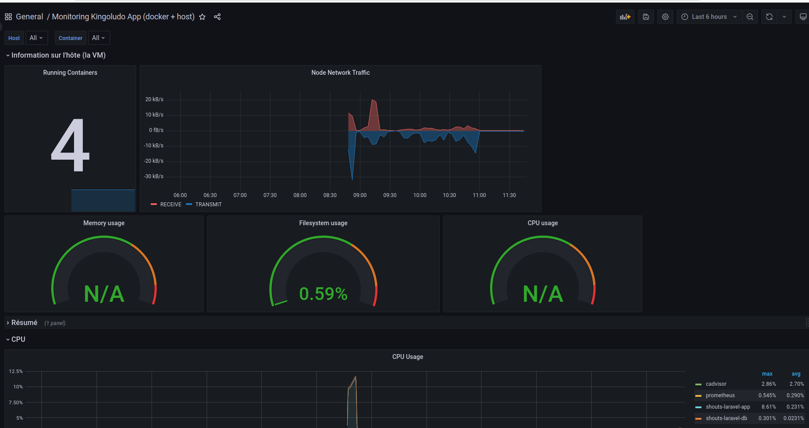
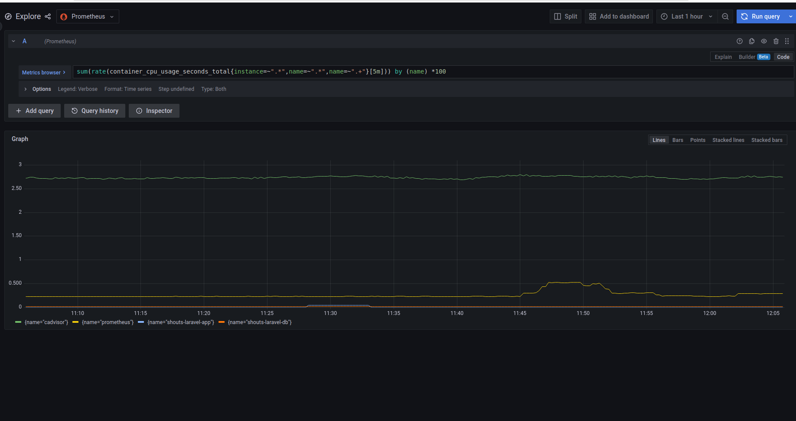

# Exercice 1 - Retrouver ses données

## Pré-requis

- Avoir accès à l'interface graphique de Grafana : par défaut : http://localhost:3000 (utilisateur : admin / mot de passe : admin (à la première connexion)
- Avoir une base de données de métriques

## Présentation 

- Un projet web contenant une application en PHP et une base de données MariaDB sont déployées dans des conteneurs
- Des métriques sont récupérées de ces conteneurs avec le collecteur CAdvisor et stocker dans une base Prométheus
- Nous allons au fur et à mesure des exercices construire un tableau de bord qui ressemblera à celui-ci :



## Ajouter une source de données à Grafana

- Dans Grafana, ouvrir le menu, puis dans l'item `Configuration`, cliquer sur Data sources
- Vous arrivez alors sur la liste des sources de données
- Pour ajouter une source de données, cliquer sur `Add data source`
- Dans la catégorie `Time serie base`, Choisir `Prometheus` 
- Vous arrivez alors sur une page de paramètrage
- Le seul paramètre obligatoire est alors l'adresse de Prometheus, à renseigner avec l'adresse qui vous a été fournie pendant la formation
- Les autres paramètres permettent par exemple de configurer une authentification, dans le cas où l'accès à Prometheus est protégé (ce n'est pas le cas dans le cadre de la formation)
- Cliquer en bas de la page sur `Save and test`
- Vous devriez obtenir un message `Data source is working`, dans le cas contraire, vérifier l'adresse saisie et les paramètres que vous avez modifié (il n'est pas nécessaire dans le cadre de la formation de modifier les paramètres)
- Vos données sont maintenant accessibles depuis Grafana

## Explorer les données

- Dans le menu de Grafana, cliquer sur Explore
- Tout en haut à côté du titre `Explore` vous pouvez sélectionner votre source de données
- Puis en sélectionnant votre source Prométheus, vous pouvez faire des requêtes pour afficher les données disponibles.
- Pour connaître la liste des données vous pouvez cliquer sur la flèche en dessous de Metrics, cela vous permet de voir les métriques qui sont disponibles dans votre source de données.
- L'ensemble des métriques disponibles est décrite ici : https://github.com/google/cadvisor/blob/master/docs/storage/prometheus.md 

## Définir les requêtes pour surveiller nos conteneurs 

- Nous avons une application web qui tournent dans deux conteneurs, que nous devons monitorer.
- Pour chaque élément nous vous donnons la requête brute à executer, vous pouvez également construire ces requêtes à l'aide du constructeur de requête
- Nous allons donc monitorer l'utilisation du CPU avec la requête suivante : 
```
sum(rate(container_cpu_usage_seconds_total{instance=~".*",name=~".*",name=~".+"}[5m])) by (name) *100

```

- Ainsi que l'utilisation de la mémoire
```
sum(container_memory_rss{instance=~".*",name=~".*",name=~".+"}) by (name)
```
- Et celle du trafic réseau reçu : 
```
sum(rate(container_network_receive_bytes_total{instance=~".*",name=~".*",name=~".+"}[5m])) by (name)
```
- Et le trafic sortant :
```
sum(rate(container_network_transmit_bytes_total{instance=~".*",name=~".*",name=~".+"}[5m])) by (name)
```
* Chacune de ces requêtes nous permet de récupérer des informations sur les métriques qui nous intéresse en utilisant les fonctions de calcul de PromQL.
* Lors de l'exécution de ses requêtes, vous obtiendrez des graphique de résultats regroupés par interval de temps pour chaque conteneur comme celui ci-dessous



## Pour aller plus loin - Définir ses indicateurs et les requêtes associées

- Définir dans votre contexte ce que vous souhaitez monitorer 
- Quels sont selon vous les métriques nécessaires à surveiller pour cela ?
- A l'aide de la [documentation de PromQL](https://prometheus.io/docs/prometheus/latest/querying/basics/) (le langage de requête de Prometheus) définir les requêtes qui vous permettent d'obtenir les métriques à surveiller pour vos propres données.
 
