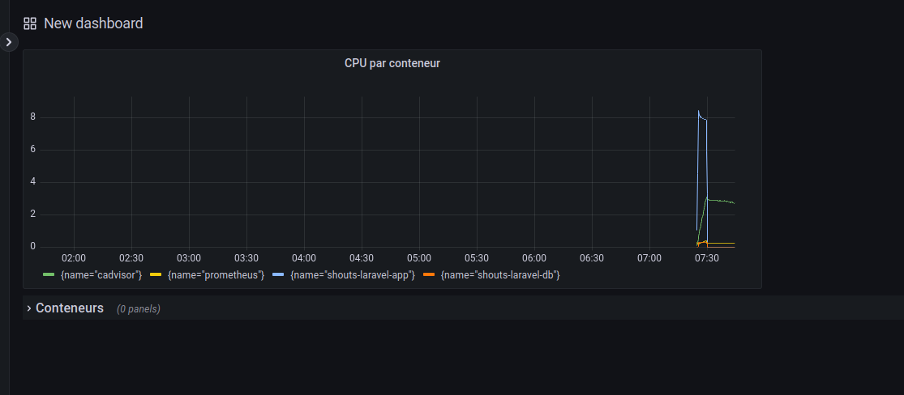
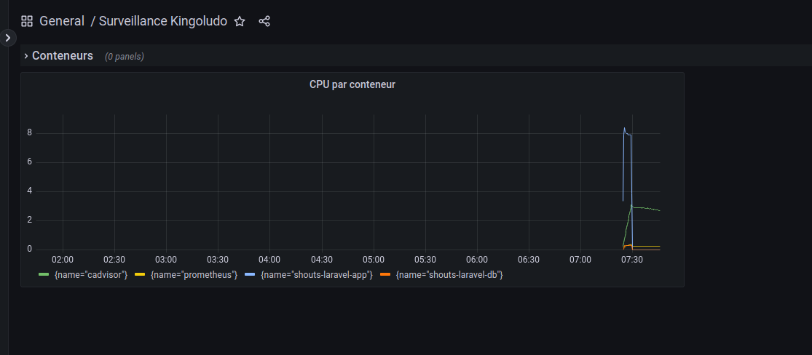
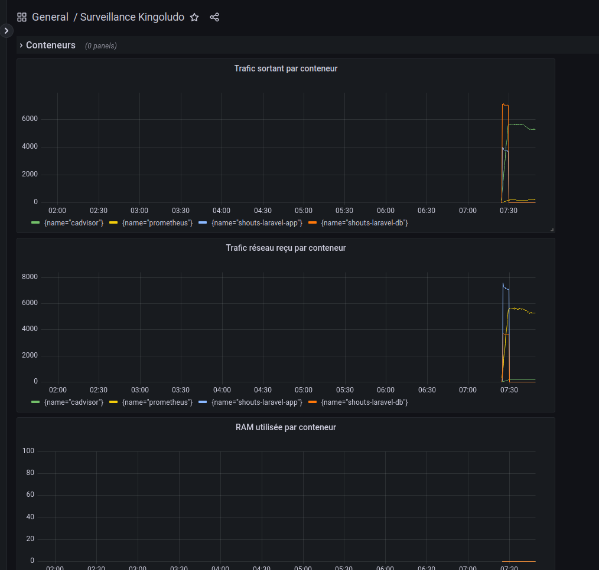
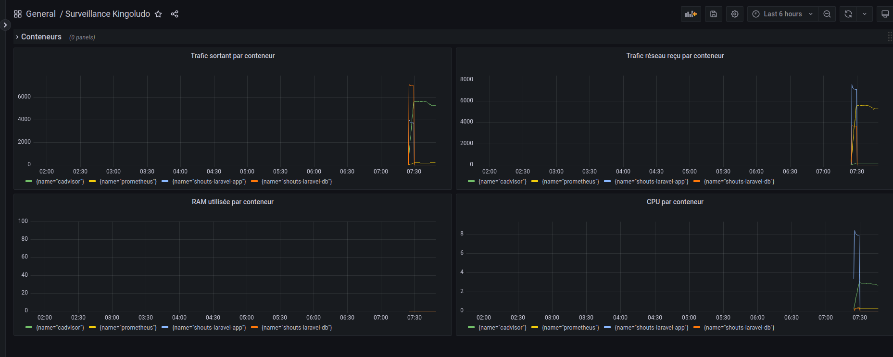
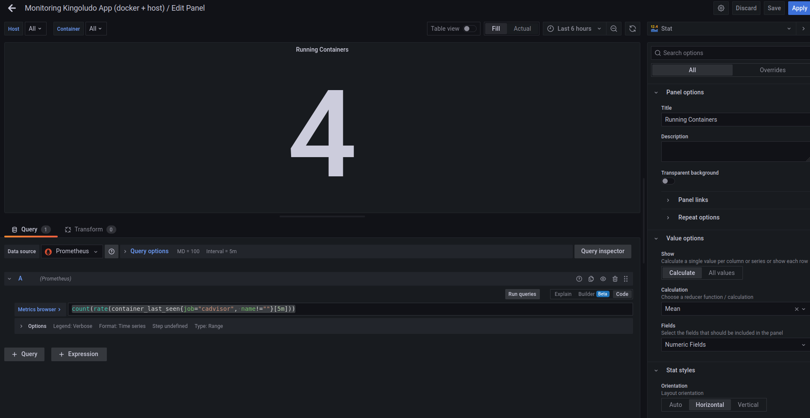
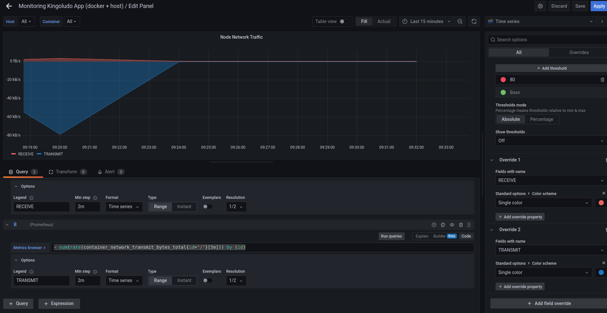
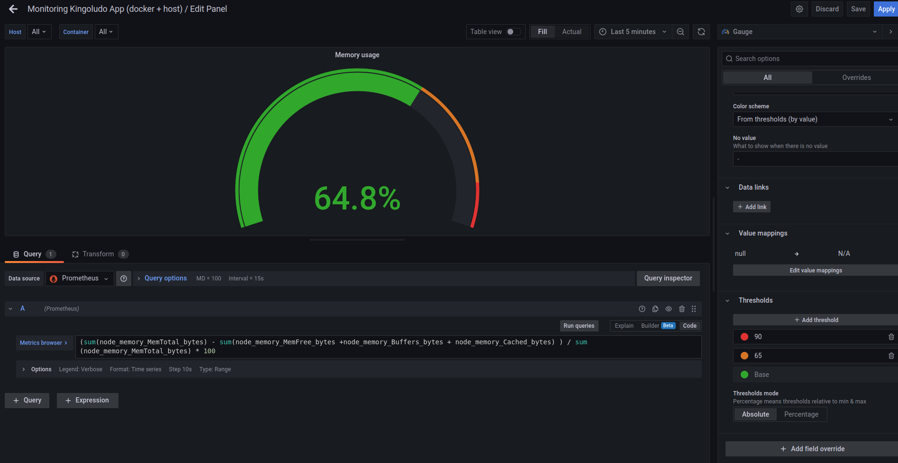
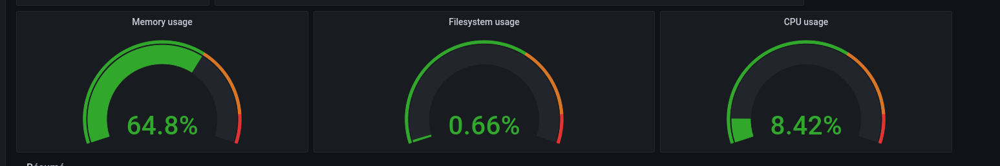

# Exercice 2 - Créer son premier tableau de bord

## Pré-requis
- Avoir accès à Grafana 
- Avoir configurer une source de données
- Avoir préparer des indicateurs à surveiller et définis les requêtes associées

## Créer le tableau de bord

- Dans Grafana, ouvrir le menu et aller sur `+ New Dashboard`
- Vous arriver alors sur la création d'un tableau de bord
- Vous pouvez alors choisir entre trois actions :
  - Add a new panel : cela vous permet de créer un nouveau graphique
  - Add a new row : les lignes vous permettent d'organiser votre tableau de bord 
  - Add a panel from library : il est possible d'enregistrer un panel dans une bibliothèque afin de les réutiliser et de les partager, cela vous donne donc accès aux panels déjà créé
 - En haut à droite vous avez également d'autres options disponibles
 - Cliquer sur la roue cranté pour arriver sur la configuration du tableau de bord
 - Définir un nom pour votre tableau de bord et enregistrer le

## Ajouter des graphiques pour les conteneurs

- En fonction des indicateurs que vous avez définis pour l'exercice 1, ajouter des panels à votre tableau de bord pour représenter graphiquement vos indicateurs.
- Commencer par ajouter une ligne qui contiendra nos graphique de surveillances des conteneurs
- Pour cela cliquer sur `Add a new row`
- Puis cliquer sur le titre `Row title` et sur la roue cranté qui apparaît à côté de ce titre
- Nommer la lignes 'Conteneurs'
- Ensuite nous allons ajouter un premier graphique pour surveiller l'utilisation du CPU de nos conteneurs
- Pour cela on ajouter un panel avec le lien `Add a new panel`
- Dans la requếte en bas de l'écran on saisit la requête de l'exercice précédent : 
```
sum(rate(container_cpu_usage_seconds_total{}[5m])) by (name) *100

```
- Pour coller la requête, il faut passer en mode code :


- Sur la droite, nous avons les options du panel, celle-ci sont différentes en fonction du type de graphique, laissons ici Time series pour ce premier graphique
- Nous allons choisir un nom pour notre graphique `CPU par conteneur`


- Nous pouvons également définir de nombreuses options comme les valeurs à afficher dans la légende, la taille et la forme de la courbe, des labels pour les axes, ainsi que des valeurs minimales et maximales, etc. 
- Une fois les options choisies, nous pouvons enregistrer le graphique à l'aide du bouton bleu `Apply` présent en haut à droite de la page. 

- Nous arrivons alors sur notre dashboard



- En cliquant sur le titre de notre graphique on peut alors le faire glisser dans la ligne que nous avons créé à l'étape précédente.



- N'oubliez pas d'enregistrer votre Dashboard en cliquant sur la petite disquette en haut à droite.

- Répeter l'ajout de panel pour les trois autres requêtes de l'exercice 1 (mémoire, réseaux entrant, réseau sortant)



- En jouant avec le positionnement et la taille des graphiques vous pouvez réarranger votre dashboard



## Ajouter des graphiques pour surveiller la VM

- Ajouter une nouvelle ligne, et nommer la `Surveillance VM`

### Compteur de conteneurs

- Créer un nouveau panel avec le lien `Add a new panel`
- Pour cela utiliser la requête 
```
count(rate(container_last_seen{}[5m]))
```
- Puis en haut à droite, choisir `Stat` 
- Comme titre mettre `Nombre de conteneurs en fonctionnement`
- Dans Value Options :
  - Show : `Calculate`
  - Calculation : `Mean`
  - Fields : `Numeric fields`
- Stats styles
  - Orientation : `Horizontal`
  - Text mode : `Auto`
  - Color mode: `None`
  - Graph mode : `None`
  - Text alignement : `Auto`
- Dans `Text size`, `Standard Options`,`Data links`,`Value Mappings`, laisser les valeurs par défaut (ou modifier les à votre convenance)
- `Thresold` permet de définir des couleurs en fonction de la valeur. Cette valeur est exprimée en mode absolue ou en pourcentage
- N'oubliez pas de cliquer sur Apply en haut à droite lorsque vous avez terminer. 



### Trafic entrant et sortant sur la VM

- Créer un nouveau panel qui va afficher le trafic entrant et sortant sur la VM
- Ce panel affichera sur le même graphique le trafic entrant et le trafic sortant
- Pour cela utiliser la première requête 
```
sum(rate(container_network_receive_bytes_total{id="/"}[5m])) by (host)
```
- Dans les options de la requête, nous ajoutons les informations suivantes :
  - Legend : `RECEIVE`
  - Min step: `2m`
  - Format: `Time series`
  - Type: `Range`
  - Exemplars: Desactivé

- Puis créer une seconde requête pour le trafic sortant :
```
- sum(rate(container_network_transmit_bytes_total{id="/"}[5m])) by (id)
```
- Nous donnons à cette requête les mêmes options que pour la première, sauf pour la legend qui devient `TRANSMIT`

- Choisir le type de graph `Time series`
- Lui donner comme titre `Trafic réseau sur le noeud`
- Nous laissons les options par défaut (que vous pouvez modifier à votre guise)
- Dans Standard Options, choisir pour Unit : `bytes/sec(SI)`
- Nous allons ensuite ajouter des surcharge de champs. Pour cela en bas des options cliquer sur `+ Add field override`
- Dans `Fields with name` mettre la valeur `RECEIVE` (qui correspond à la légende de la première requête), puis choisir une couleur
- Répéter l'opération pour la deuxième requête avec le nom de la deuxième légende et choisir une autre couleur.




### Jauges

- Nous allons définir des jauges en commençant par la surveillance du système de fichier
- Pour cela utiliser la requête suivante qui va calculer la mémoire totale utilisée sur la machine (VM)
```
(sum(node_memory_MemTotal_bytes) - sum(node_memory_MemFree_bytes +node_memory_Buffers_bytes + node_memory_Cached_bytes) ) / sum(node_memory_MemTotal_bytes) * 100
```
- A droite choisir un grap de type `Gauge`
- Comme titre Mettre : `Utilisation mémoire`
- Dans `Value Options`
  - Show: `Calculate`
  - Calculation : `Last`
  - Fields : `Numeric fields`
- Dans `Gauge`, cocher `Show thresold markers`
- Dans `Standard Options`
  - Unit: `Percent(0-100)`
  - Min: `0`
  - Max : `100`
  - Color scheme : `From thresolds (by value)`
- Dans `Thresolds`
  - Rouge : 90
  - Orange : 65
  - Vert : Base
  - Mode : Absolute
- N'oubliez pas d'appliquer les modifications avec le bouton `Apply`



- Répeter l'opération pour le système de fichier avec la requête : 
```
sum (container_fs_limit_bytes - container_fs_usage_bytes) / sum(container_fs_limit_bytes)
```

- Ainsi que pour l'utilisation du CPU avec la requête
```
sum(sum by (container_name)( rate(container_cpu_usage_seconds_total[1m] ) )) / count(node_cpu_seconds_total{mode="system"}) * 100
```


- Mettre les trois graphiques côte à côté pour obtenir un résultat semblable à celui-ci :



