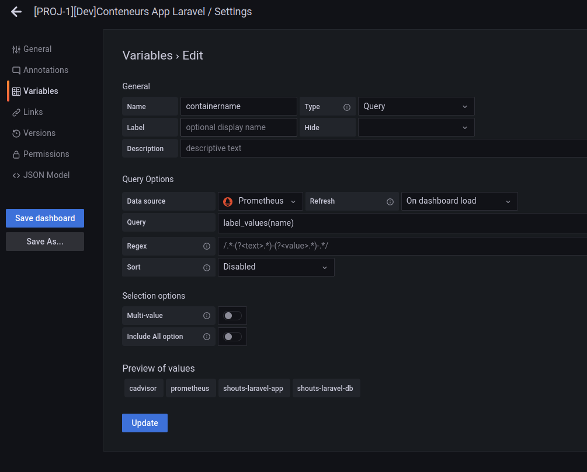
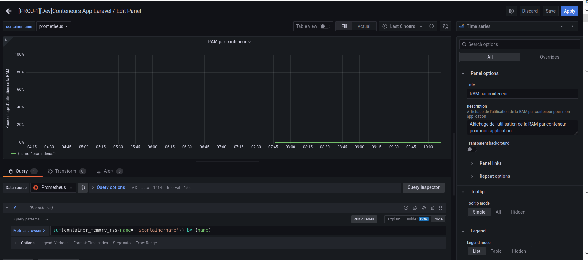

# Exercice 4 - Partage du tableau de bord

## Pré-requis

* Avoir fais les exercices précédents


## Partage d'un Panel

* Créer un panel qui affiche le nombre de conteneurs
* Enregistrer ce panel dans la Library 
* Créer un nouveau Dashboard et utiliser votre panel depuis la Library
* Partager un instantané du panel avec un autre stagiaire et la formatrice par mail

## Partage du tableau de bord

* Exporter votre dashboard des exercices précédents, et mettre le fichier json récupéré dans Teams
* Partager un lien par mail de votre dashboard avec tous en mettant le lien sur Teams (on ne pourra pas accéder à ce lien, tant que nous ne pourrons pas nous connecter avec un compte utilisateur sur votre Grafana)
* Récupérer un tableau de bord partagé par un autre stagiaire et importé le dans votre propre Grafana

## Définition d'une variable

* Ajouter à votre tableau de bord une variable permettant de filtrer les données pour un ou plusieurs conteneurs parmi les différents conteneurs disponibles.
* Pour cela déclarer votre variable dans les paramètres du Dashboard, menu Variables.
* Cliquer sur New 
* Choisir un nom de variable, puis le type de variable (ici nous choisissons Query pour récupérer une liste dynamique de nom de container). Dans la requête nous utilisons la requêtes suivantes pour lister les conteneurs : 
```
label_values({__name__=~"container.*"},name)
```
* Ensuite vous définissez le filtre à appliquer 



* La variable apparaît alors en haut du tableau de bord.

## Utiliser la variable dans ses requêtes

* Puis utiliser cette variable dans vos requêtes pour chacun de vos panels afin de filtrer les données, on ajoute entre accolade le nom du paramètre de filtre suivi de = et le nom de la variable précédé par le symbole dollar.

Exemple : 
La requête : 
```
sum(rate(container_cpu_usage_seconds_total{name=~".*",name=~".+"}[5m])) by (name) *100
```

Deviendra : 
```
sum(rate(container_cpu_usage_seconds_total{name=~"$containername",name=~".+"}[5m])) by (name) *100
```




* Reprenez les requêtes que nous avons utiliser dans les différents graphs, et ajouter l'utilisation de la variable containername que vous avez créé sur les graphiques qui concerne les conteneurs

* Puis changer le conteneur sélectionné et observé la modification des graphiques


## Pour aller plus loin - Définir ses propres variables

* Selon vous, pour votre propre problématique de monitoring, certaines variables seraient elles nécessaires ?
* Sont elles statiques ou dynamiques ? 
* Dans le cas où elles sont dynamiques, pouvez vous écrire la requêtes pour récupérer votre liste dynamique ?
