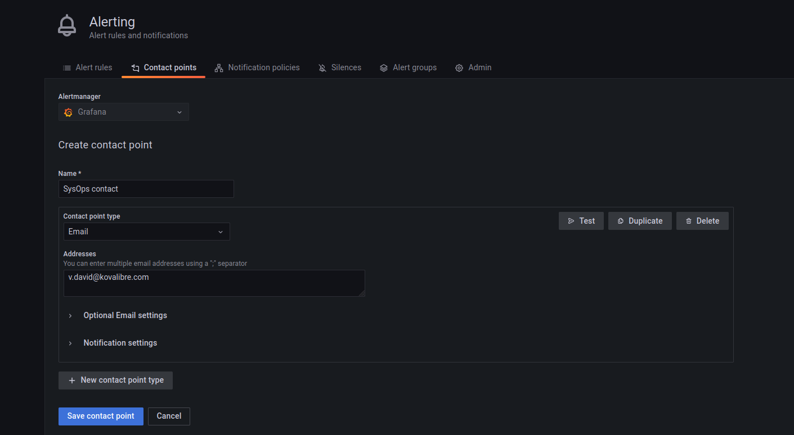
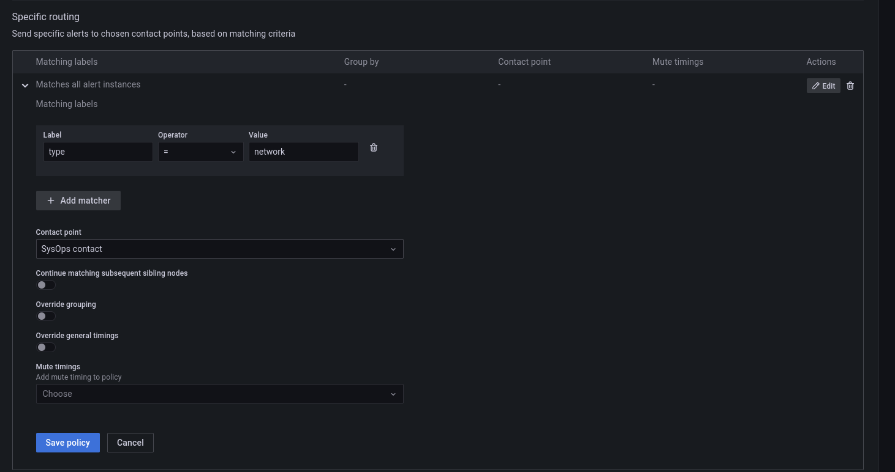
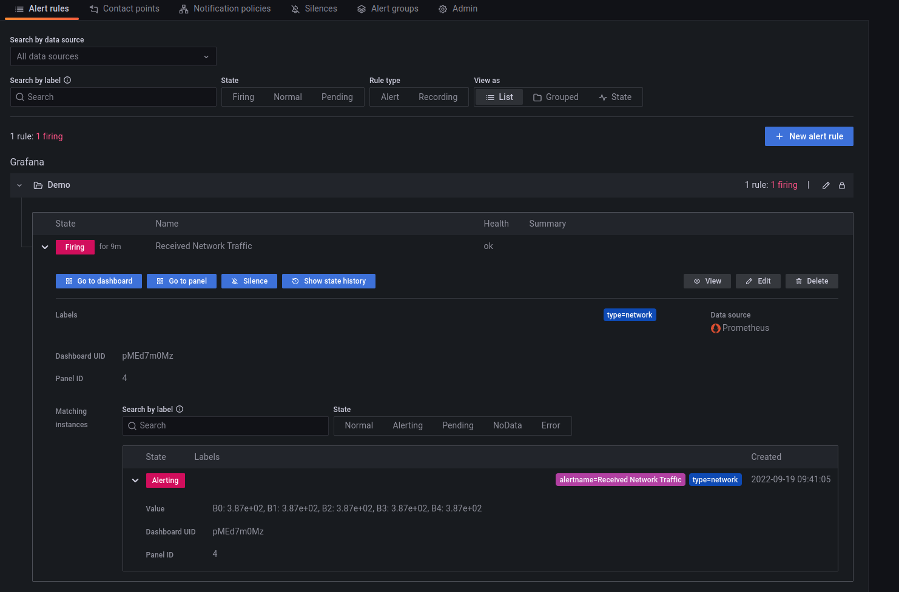

# Exercice 5 - Alertes

## Pré-requis

* Avoir un tableau de bord configuré dans Grafana
* Avoir créer un dossier dans les dashboard

## Création d'une alerte

### Définir le seuil
* Sur votre dashboard, choisir le panel qui affiche le trafic réseau entrant
* Ouvrir votre Panel en modification, puis sélectionner l'onglet `Alert`
* Puis cliquer sur `Create Alert`

* Choisir maintenant la valeur `count` dans la liste déroulante `When`
* Définir une valeur à 5

### Evaluation de l'alerte

* Dans Evaluate laisser les paramètre par défaut 

* Dans La section `Configure no data and error handling`
    * Pour `Alert state if no data or all values are null` choisir `Ok`

### Détail de l'alerte

* Dans la section `3 Add details for your alert`, vous pouvez :
    * donner un nom à votre alerte
    * La ranger dans un dossier (préalablement créer dans les dossiers des dashboard) puis créer un groupe
    * Donner des informations supplémentaire, par défaut l'UID du dashboard et l'ID du Panel sont définies

### Notification lié à votre Alerte

* Grafana utilise un système de notification basé sur des labels, il est donc important de définir les labels qui permettront l'envoi des notifications
* Ici nous ajoutons un label avec pour clé `type` et pour valeur `network`
* Ceux ci seront utilisés après pour la définition de la police de notification

* N'oubliez pas de cliquer sur `Save` en haut à droite pour enregistrer votre alerte

## Définir le point de contact et la police de notification

### Point de contact
* Dans le menu de gauche, cliquer sur l'icône des alertes, puis choisir `Contact points`
* Nous pouvons alors définir un template de message en cliquant sur + New template et en utilisant le langage de template de GO, voir la documentation : https://grafana.com/docs/grafana/latest/alerting/contact-points/message-templating/template-data/ 
* Ici nous utiliserons le template par défaut.
* Puis nous pouvons aussi définir un point de contact, c'est à dire un canal qui sera utilisé pour envoyer votre alerte.
* Pour cela cliquer sur `+ New contact point`
* Renseigner un nom, un type de contact et les paramètres correspondant, ici nous choisirons email mais cela peut être une alerte vers un système de chat, ou un autre système d'alerte comme AlertManager

### Police de notification
* Dans le menu de gauche, cliquer sur l'icône des alertes, puis choisir `Notification policies`
* Puis nous créons une police de notification spécifique en cliquant sur `+ New specific policy`
* Nous devons alors choisir le ou les labels qui vont correspondre à notre police de notification (ici, clé type, value network)
* Puis un point de contact (celui que nous avons créé à l'étape précédente)
* Puis nous enregistrons la police de notification en cliquant sur `Save policy`

## Tester votre alerte

* Ouvrir dans plusieurs onglets l'application web en moins de 5 minutes sur l'adresse : 
IP du serveur:8090 (l'adresse exacte de l'application vous serez communiqué pendant la formation)
* Cela devrait alors déclencher l'alerte, vous pouvez le vérifier dans l'interface en allant dans les règles d'alertes via le menu des Alertes et vous obtiendrez alors une alerte qui est au statut `Firing`.

## Pour aller plus loin - Définir ses propres alertes

* Pour chacun des éléments que vous avez choisi de monitorer, définir les seuils qui doivent déclencher des alertes
* Une fois les seuils définis, créer les alertes et les notifications associées
