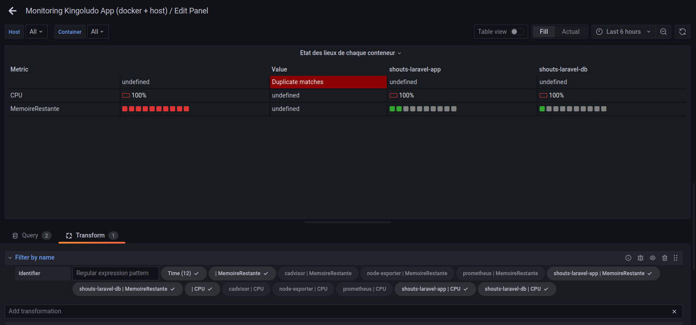

# Exercice 7 - Travailler avec des données venant de plusieurs sources


## Pré-requis

- Avoir accès à un Grafana
- Avoir configurer une source de données Promethéus
- Avoir accès à une deuxième source de donnée, ici nous utilisons InfluxDb


## Ajouter la nouvelle source de données

* Aller dans Configuration > Data Sources sur Grafana
* Cliquer sur le bouton `Add Data Source`
* Choisir `InfluxDB`
* Remplir les paramètres, en choisissant 
    * Query Language : Flux
    * URL : coller l'URL fournie
    * Laisser Basic auth cocher
    * Dans les details de basic auth, saisir le User et le Password avec ceux fournis
    * Dans InfluxDB détails, remplir les trois premiers champs avec les informations fournies
* Cliquer sur Save and test

## Utiliser plusieurs sources de données dans un Panel

* Aller dans un tableau de bord et créer un nouveau Panel
* Dans Query, à côté de Data Source, séléctionner `Mixed`
* Vous pouvez ensuite définir plusieurs requêtes pour vos sources de données
* Créer une première requête avec la source Prometheus, et choisir le champs `container_cpu_usage_seconds_total` pour voir la consommation des conteneurs
* Créer ensuite une seconde requête avec la source de données InfluxDB et saisir une requête Flux, par exemple pour récupérer l'utilisation du CPU par la VM sur laquelle sont lancer les container :
```
from(bucket: "kovalibre_bucket")
  |> range(start: v.timeRangeStart, stop: v.timeRangeStop)
  |> filter(fn: (r) => r["_measurement"] == "cpu")
  |> aggregateWindow(every: v.windowPeriod, fn: mean, createEmpty: false)
  |> yield(name: "mean")
```
* Cliquer sur Apply en haut à droite et vous devriez avoir un graphique qui montre en parallèlle l'utilisation du CPU pour chaque conteneur, ainsi que l'utilisation du CPU de la VM.

## Transformer les données

* Il est également possible dans Grafana de manipuler les données avant qu'elle ne soient utilisées dans une visualisation
* Pour cela ouvrir un Panel en édition et descendre au niveau de la requête
* Vous avez alors un onglet Transform
* Vous avez alors la possibilité de faire différentes transformations, voir la documentation de grafana : https://grafana.com/docs/grafana/latest/panels/transform-data/transformation-functions/ 

* Par exemple sur le panel de Boom table vous pouvez supprimer les colonnes des conteneurs qui ne nous intéresse pas.
* pour cela modifier le Panel,
* Choisir l'onglet `Transform`
* Ajouter une transformation de type `Fiter by name` et decocher les nom qui contiennent cadvisor, node-exporter et prometheus
* Vous obtenez alors un tableau avec uniquement les conteneurs applicatifs et le total



## Pour aller plus loin
* Par rapport aux métriques que vous aviez définis au départ, utiliser une ou plusieurs transformations pour affiner vos tableaux de bord
