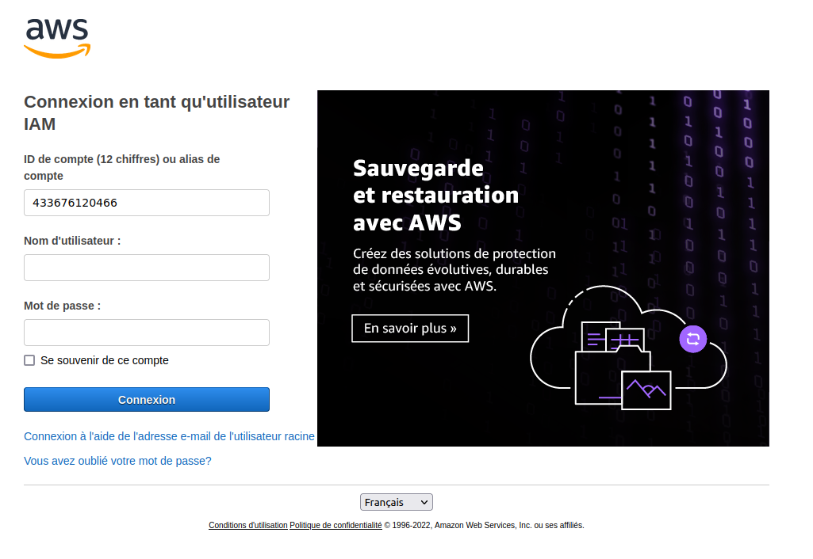
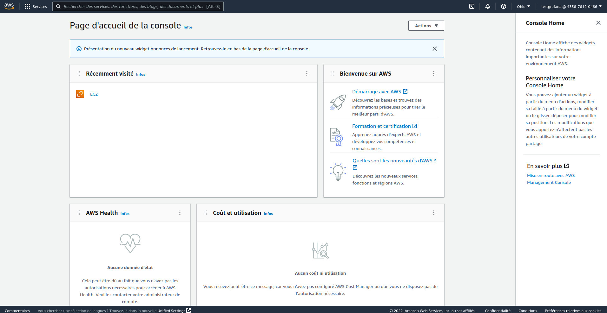
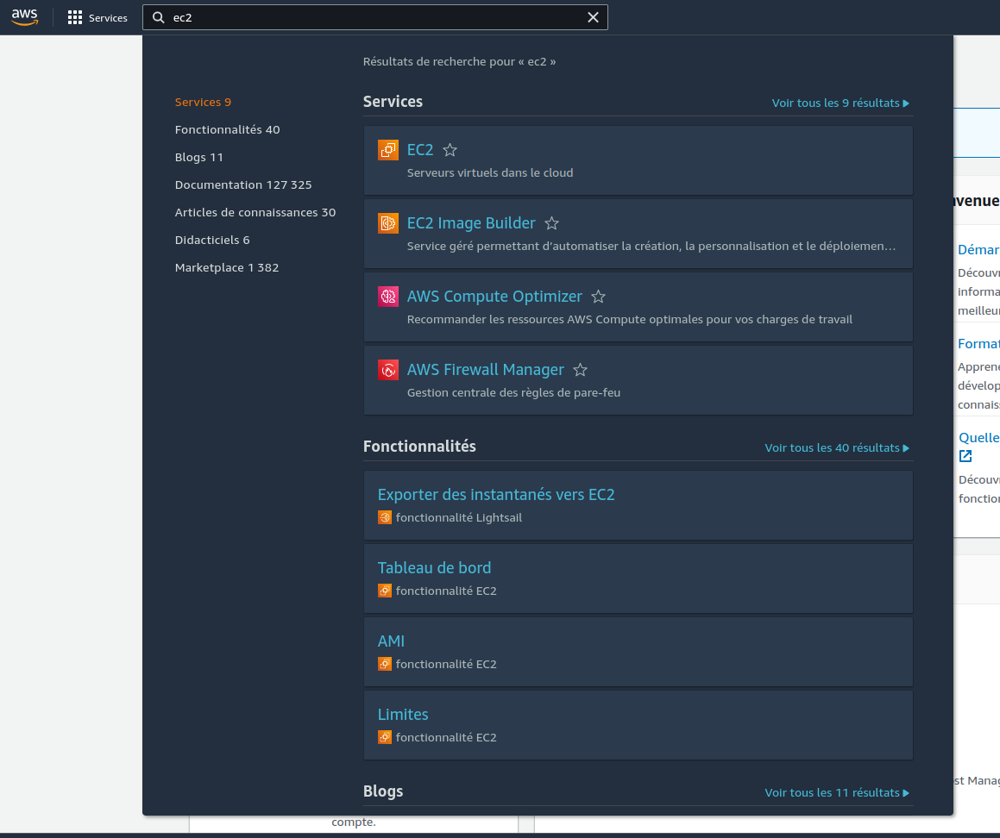
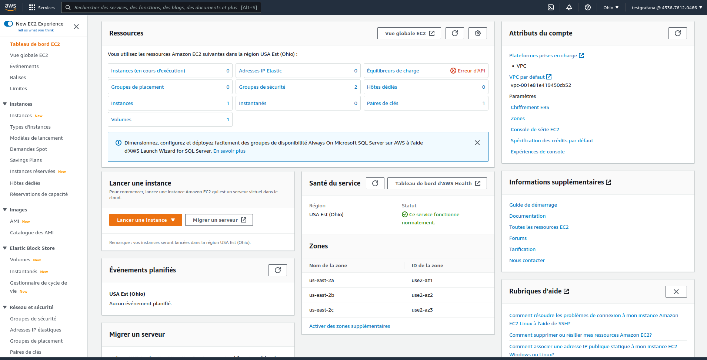
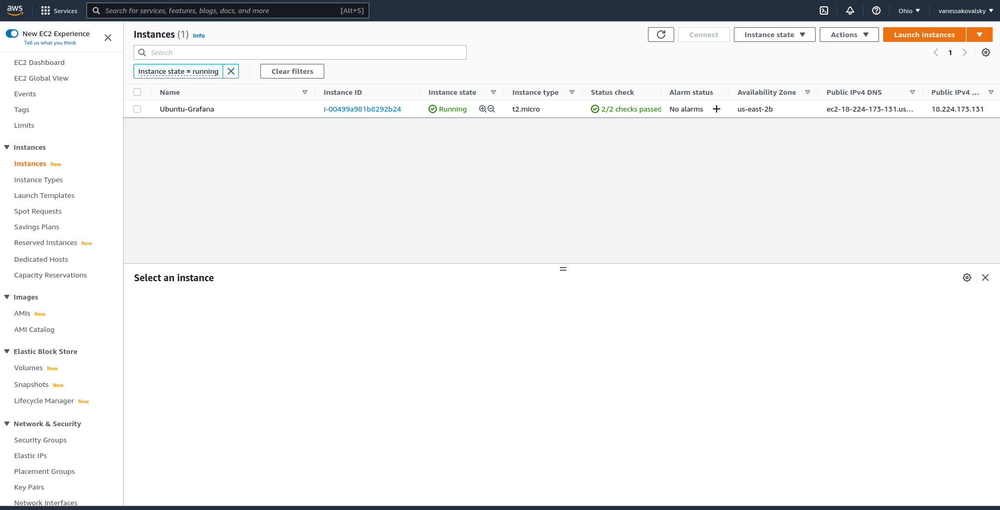
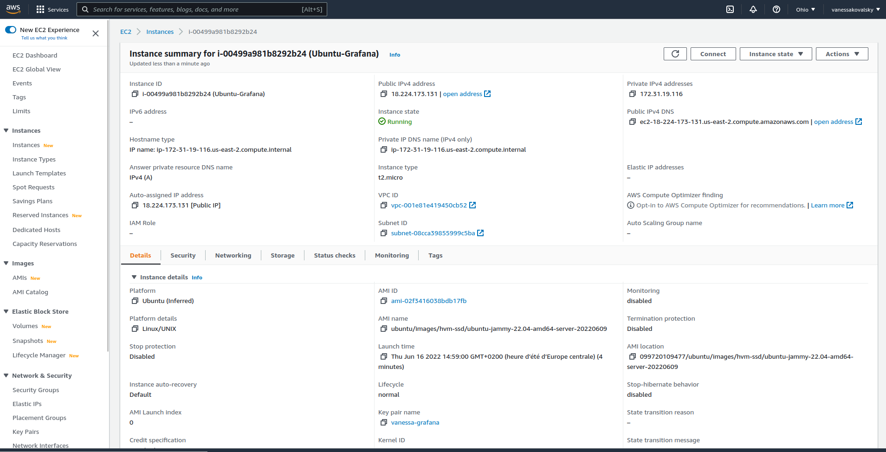
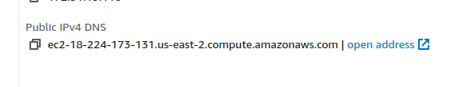
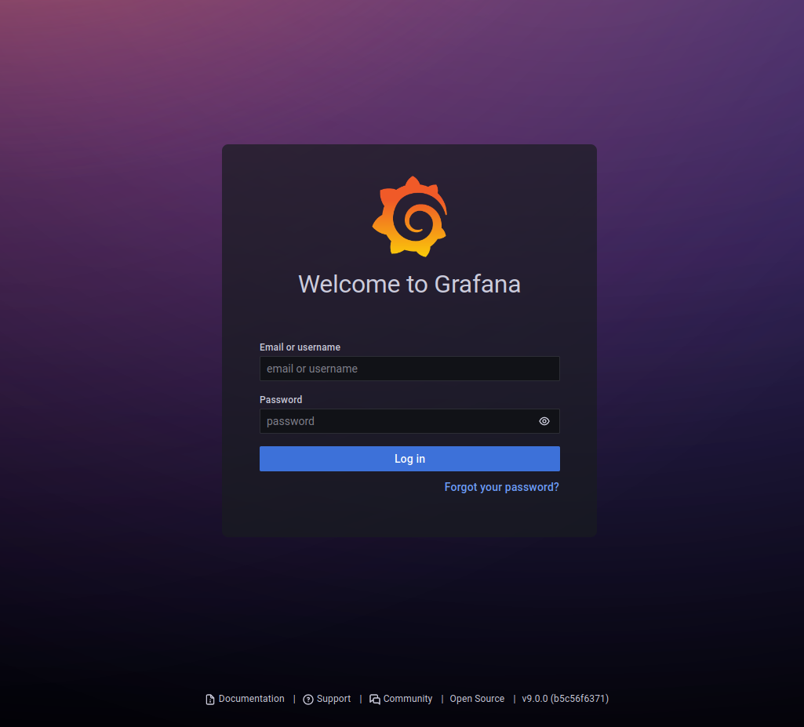
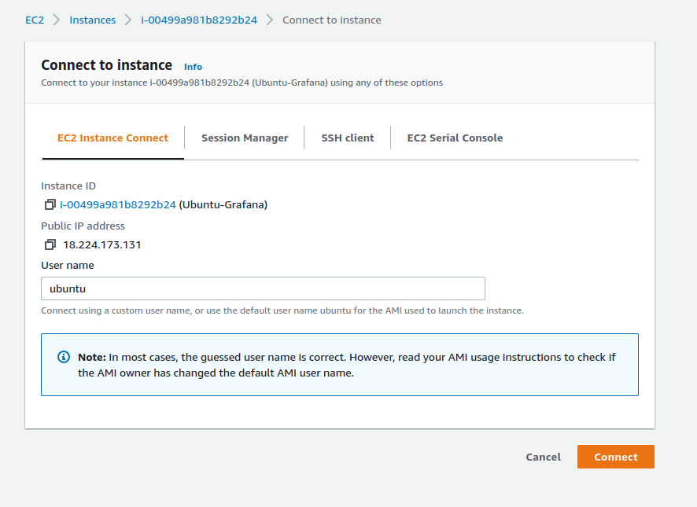
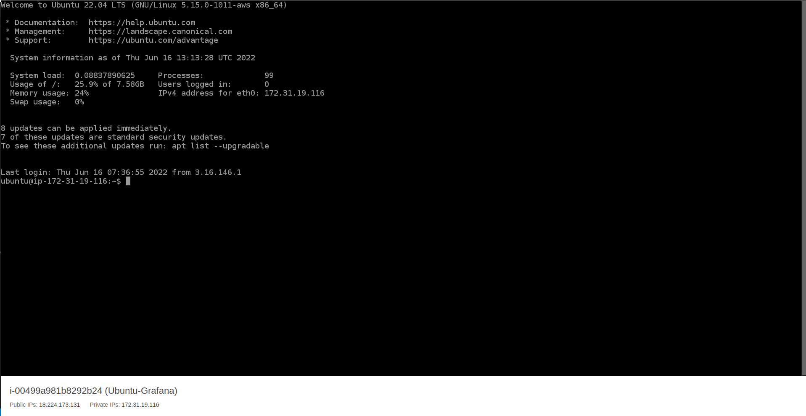

# Prise en main de l'environnement

## Pré-requis : 
* Un compte AWS vous a été fourni, avec les informations nécessaires pour accéder aux environnements
* Vous disposer d'un navigateur web et d'une connexion internet

## Accéder à la machine Grafana

* Votre machine avec Grafana est installé sur AWS, vous allez pouvoir accéer à celle-ci de deux manières : 
    * En SSH via votre navigateur
    * Via l'interface graphique de Grafana dans votre navigateur

* Pour vous accéder à votre machine, vous devez accéder à AWS.
* Cliquer sur ce lien : https://433676120466.signin.aws.amazon.com/ 
* Vous arriver alors sur une page identique à celle-ci : 

* Entrer alors le nom d'utilisateur qui vous a été fourni ainsi que le mot de passe et cliquer sur Connexion 
* Vous arrivez alors sur une page d'accueil qui ressemble à celle-ci :

* Il s'agit de la page d'accueil de la console web AWS.
* En haut à gauche, vous avez un logo AWS, à sa droite un bouton Services, et encore à droite une barre de recherche.
* Taper dans la barre de recherche le terme "ec2"
* Le résultat s'affiche comme sur l'image suivante

* Cliquer en dessous de services sur la la ligne en bleu EC2 pour accéder aux instances (VM)
* Vous arrivez alors sur la page d'accueil des instances EC2 qui ressemble à celle-ci 

* Dans le bloc central sur la page (appelé "Ressources"), cliquer sur le liens appelé Instances (en cours d'exécution)
* Vous arrivez alors sur une liste des instances en cours d'exécutions qui ressemble à celle-ci

* Identifier alors la ligne dont le nom correspond à celui qui vous a été fourni avec vos identifiants
* Sur cette ligne, cliquer sur le lien de l'instance dans la colonne Instance ID
* Vous arrivez alors sur une page qui présente les détails de votre instance 

* A partir de cette écran vous allez pouvoir récupérer les informations pour accéder à l'interface graphique de Grafana mais aussi pour vous connecter en SSH à la machine quand ce sera nécessaire (pour l'installation de plugins par exemple)

### Accès à l'interface graphique de grafana

* Dans la page de détails de l'instance, sur la colonne de droite du bloc Instance summary, vous avez un champ : `Public IPv4 DNS` comme celui-ci :

* Copier cette adresse, et coller la dans un nouvel onglet, avant de valider, ajouter à la fin `:3000` (l'interface graphique est accessible sur le port 3000 ) /!\ que votre navigateur ne vous redirige pas en HTTPS, il n'est pas configuré sur les VM d'entrainement
* Vous arrivez alors sur la page d'accueil de Grafana

### Accès en SSH

* Revenir sur la page de détails de l'instance EC2 
* En haut à droite de la page vous avez un bouton Connect, cliquer sur ce bouton, cela ouvre la fenêtre suivante :

* Rester sur l'onglet EC2 Instance Connect et laisser le username par défaut, puis cliquer sur le bouton orange Connect
* Un nouvel onglet s'ouvre et vous accéder à la machine en SSH :

* Pour vous deconnecter du SSH, il suffit de fermer l'onglet