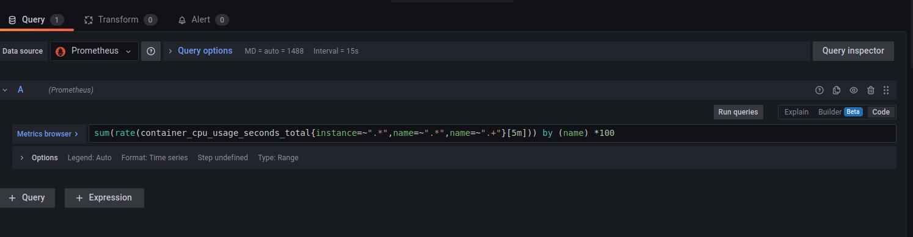
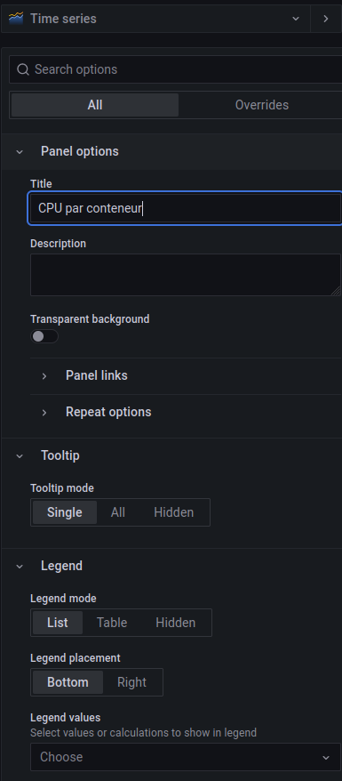

# Exercice 2 - Créer son premier tableau de bord

## Pré-requis
- Avoir accès à Grafana 
- Avoir configurer une source de données
- Avoir préparer des indicateurs à surveiller et définis les requêtes associées

## Créer le tableau de bord

- Dans Grafana, ouvrir le menu et aller sur `+ New Dashboard`
- Vous arriver alors sur la création d'un tableau de bord
- Vous pouvez alors choisir entre trois actions :
  - Add a new panel : cela vous permet de créer un nouveau graphique
  - Add a new row : les lignes vous permettent d'organiser votre tableau de bord 
  - Add a panel from library : il est possible d'enregistrer un panel dans une bibliothèque afin de les réutiliser et de les partager, cela vous donne donc accès aux panels déjà créé
 - En haut à droite vous avez également d'autres options disponibles
 - Cliquer sur la roue cranté pour arriver sur la configuration du tableau de bord
 - Définir un nom pour votre tableau de bord et enregistrer le

## Ajouter des graphiques pour le nombre de courses

- En fonction des indicateurs que vous avez définis pour l'exercice 1, ajouter des panels à votre tableau de bord pour représenter graphiquement vos indicateurs.
- Commencer par ajouter une ligne qui contiendra nos graphique de surveillances des conteneurs
- Pour cela cliquer sur `Add a new row`
- Puis cliquer sur le titre `Row title` et sur la roue cranté qui apparaît à côté de ce titre
- Nommer la lignes 'Conteneurs'
- Ensuite nous allons ajouter un premier graphique pour surveiller l'utilisation du CPU de nos conteneurs
- Pour cela on ajouter un panel avec le lien `Add a new panel`
- Dans la requếte en bas de l'écran on saisit la requête de l'exercice précédent : 
```
SELECT
  --1--
  time_bucket('1 day', pickup_datetime) AS time,
  --2--
  COUNT(*)
FROM rides
WHERE $__timeFilter(pickup_datetime)
GROUP BY time
ORDER BY time
```
- Pour coller la requête, il faut passer en mode code :


- Sur la droite, nous avons les options du panel, celle-ci sont différentes en fonction du type de graphique, laissons ici Time series pour ce premier graphique
- Nous allons choisir un nom pour notre graphique `Nombre de courses`



- Nous pouvons également définir de nombreuses options comme les valeurs à afficher dans la légende, la taille et la forme de la courbe, des labels pour les axes, ainsi que des valeurs minimales et maximales, etc. 
- Une fois les options choisies, nous pouvons enregistrer le graphique à l'aide du bouton bleu `Apply` présent en haut à droite de la page. 

- Nous arrivons alors sur notre dashboard


- En cliquant sur le titre de notre graphique on peut alors le faire glisser dans la ligne que nous avons créé à l'étape précédente.


## Ajouter une ligne avec le montant moyen par jour

- On peut aussi créer un graphique pour le montant moyen payé chaque jour à l'aide la requête :
```
SELECT date_trunc('day', pickup_datetime)
AS day, avg(fare_amount)
FROM rides
WHERE $__timeFilter(pickup_datetime)
GROUP BY day
ORDER BY day;
```

## Ajouter une ligne avec les notes de chaque course

- Ainsi que le nombre de courses par types de tarifs avec la requête :
```
SELECT rate_code, COUNT(vendor_id) AS num_trips
FROM rides
WHERE $__timeFilter(pickup_datetime)
GROUP BY rate_code
ORDER BY rate_code;
```

## Une ligne pour les trajets depuis et vers l'aeroport 
- Nous pouvons également ajouter le nombre de courses en direction ou depuis l'aeroport avec la requête :
```
SELECT rates.description,
    COUNT(vendor_id) AS num_trips,
    AVG(dropoff_datetime - pickup_datetime) AS avg_trip_duration,
    AVG(total_amount) AS avg_total,
    AVG(passenger_count) AS avg_passengers
FROM rides
JOIN rates ON rides.rate_code = rates.rate_code
WHERE rides.rate_code IN (2,3) AND $__timeFilter(pickup_datetime)
GROUP BY rates.description
ORDER BY rates.description;
```
- N'oubliez pas d'enregistrer votre Dashboard en cliquant sur la petite disquette en haut à droite.

- Votre tableau de bord doit maintenant ressembler à celui-ci : 


